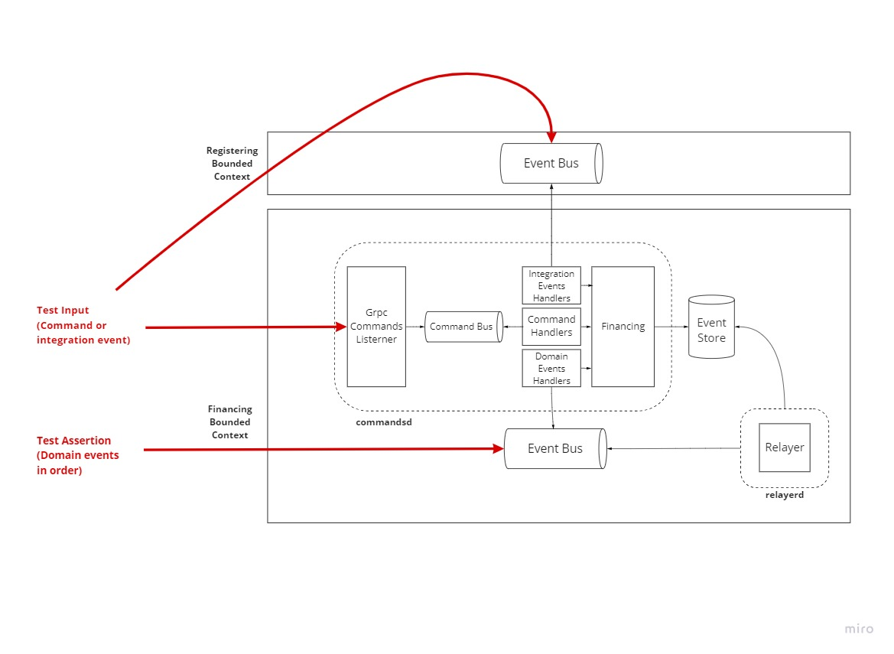
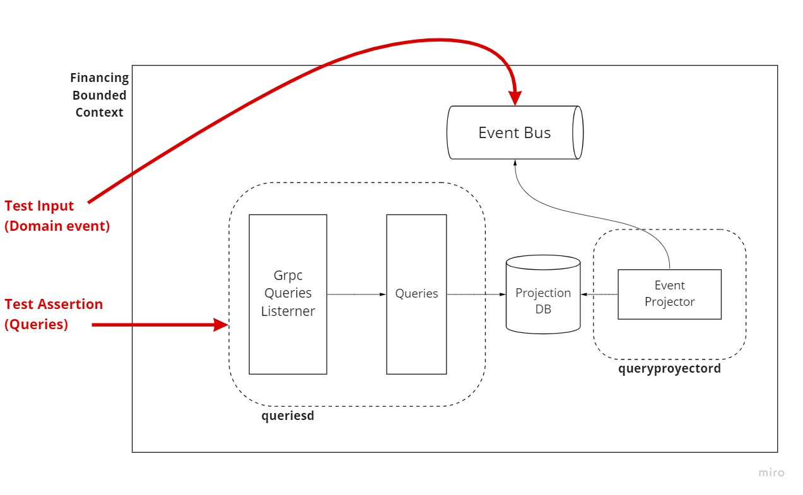
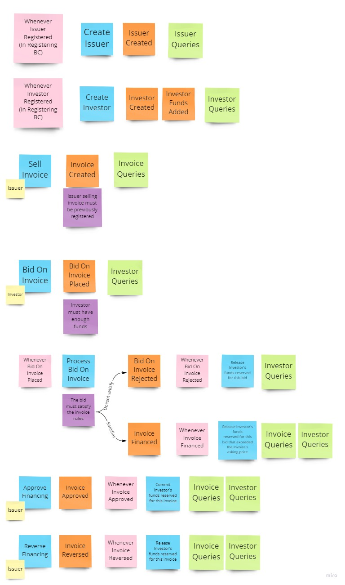

# go-example-financing

This example project aims to demonstrate or serve as inspiration on how to build an event driven architecture using the event sourced and CQRS patterns in go. Enabled by two key libraries:
- "esrc" which enables Event Sourcing (https://github.com/pperaltaisern/esrc)
- "watermill" which enables CQRS and messaging (https://github.com/ThreeDotsLabs/watermill)

The domain used as example is responsible to register Issuers that can put Invoices on sold, and Investors that can finance Invoices. The domain is splitted in two bounded contexts: Registering and Financing. This example focus on the later, where it has to synchronize with registrations via integration events, and must handle Invoice finantiation and Investors' balances. 

## Architecture


### Design choices
- An aggregate represents a transaction in the event store, therefore an aggregate is designed to protect an invariant.
- A handler can only mutate an aggregate at a time. This reduces the chances of optimistic concurrency conflicts and makes it easier to shard the application and event store by aggregate ID.
- Processes that have to mutate multiple aggregates will span a [choreograhy based SAGA](https://microservices.io/patterns/data/saga.html).
- Because of the SAGA, aggregates might need compensatory commands.
- The "Grpc Commands Listener" component could be deployed int its own. Its only responsability is to validate commands formatting and enqueuing them.
- Having a queue for commands enables a retry mechanism and a buffer that protects the application from spikes. We lose the ability to inform the client about the errors of the domain (at least in a synchronous way).
- Command that create new aggregates are generating new IDs in the "Listener" and returning them to the client. But the command handler could invalidate the command and the aggregate woulnd't be persisted.
- Events from the event store are collected by the "Relayer" component every 100ms and published into the event bus. Events might be repeated but they are always inserted in order.

### Testing strategy
Acceptance test are done against a running application that is waken up using docker-compose. The command side and the query side are being tested separately. 

In the first, commands are sended to the Listener as a test input, and assertions are done reading from the event bus via a "test subscription", asserting that events published are those that the test expects (in order).



For the query side, the input are domain events that are published in the event bus, assertions are done agains the result of grpc queries.



## Acceptance criteria
Use cases are in event storming notation where:

-  Command or use case.
-  User triggering the command.
-  Events raised as a result of the command's execution.
-  Policies to take into consideration when processing the command.
-  Event handling of raised events.
-  Read Models that must be updated asynchronously by raised events.



## Demo


### DB state
To put some visualization on the difference between the state of the "Event Store" vs the state of the "Projection DB", there are some snapshots of the aggregates showed in the demo:

- Invoice in Event Store:
> 

- Invoice in Projection DB:
> 

- Investor in Event Store:
> 

- Investor in Projection DB:
> 


## Dev
Run:
```bash
docker-compose up 
go run cmd/populate/main.go # publishes integration events for registering issuers and investors
```
Use a grpc client like [bloomrpc](https://github.com/bloomrpc/bloomrpc) to interact with the application. Send commands to port :8080 and queries to :8081.


Unit test:
```bash
go test ./... -short
```

Acceptance test:
```bash
docker-compose up -d
go test ./acceptance/... -v -p 1 -count 1
```

Gen proto:
```bash
protoc ./api/*.proto --go_out=api --go-grpc_out=api
```
