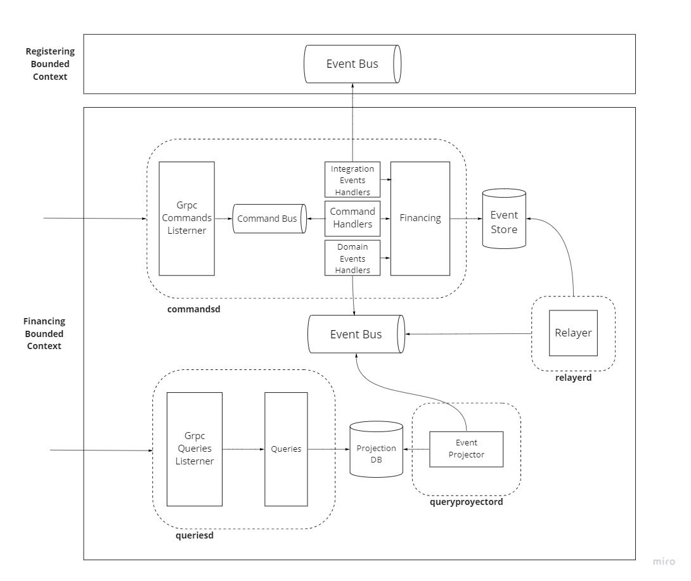
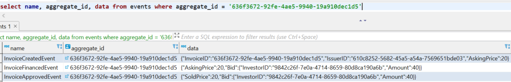

# go-example-financing

This example project aims to demonstrate or serve as inspiration on how to build an event driven architecture using the event sourced and CQRS patterns in go. Enabled by two key libraries:
- "esrc" which enables Event Sourcing (https://github.com/pperaltaisern/esrc)
- "watermill" which enables CQRS and messaging (https://github.com/ThreeDotsLabs/watermill)

The domain used as example is responsible to register Issuers that can put Invoices on sold, and Investors that can finance Invoices. The domain is splitted in two bounded contexts: Registering and Financing. This example focus on the later, where it has to synchronize with registrations via integration events, and must handle Invoice finantiation and Investors' balances. 

## Architecture


## Acceptance criteria

## Demo


### DB state
To put some visualization on the difference between the state of the "Event Store" vs the state of the "Projection DB", there are some snapshots of the aggregates showed in the demo:

- Invoice in Event Store:
> 

- Invoice in Projection DB:
> 

- Investor in Event Store:
> 

- Investor in Projection DB:
> 

## Code

## Testing strategy

## Considerations

## Dev

Run:
```bash
docker-compose up 
go run cmd/populate/main.go # publishes integration events for registering issuers and investors
```
Use a grpc client like [bloomrpc](https://github.com/bloomrpc/bloomrpc) to interact with the application. Send commands to port :8080 and queries to :8081.


Unit test:
```bash
go test ./... -short
```

Acceptance test:
```bash
docker-compose up -d
go test ./acceptance/... -v -p 1 -count 1
```

Gen proto:
```bash
protoc ./api/*.proto --go_out=api --go-grpc_out=api
```
